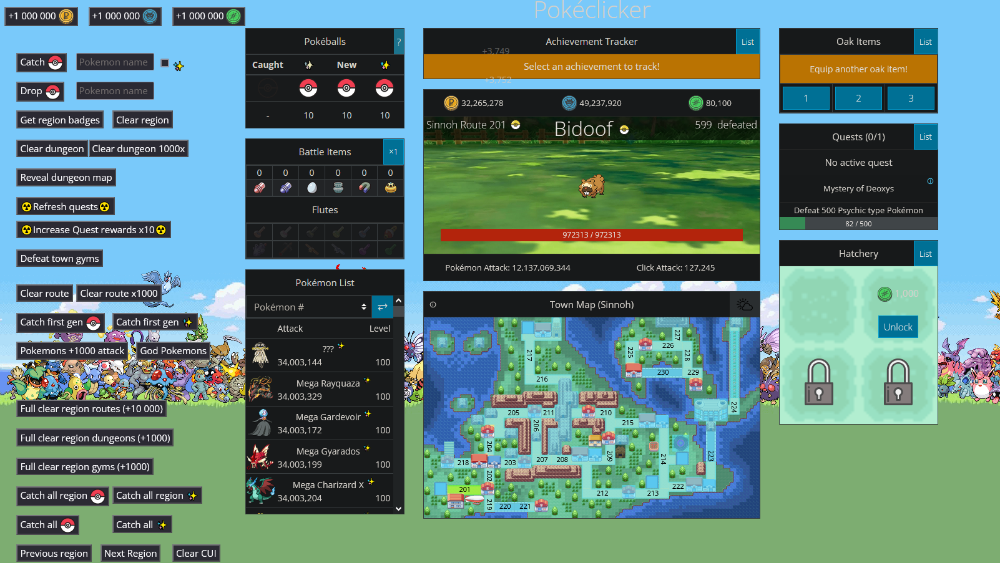

# poketools

## Developer tools for pokeclicker :
- Catching/Dropping pokemons
- Altering game statistics
- Automating tedious tasks
- Clearing and catching whole regions

## Running it yourself:
- Copy pokeclicker.js' content into your browser's developer console
- Type `run()` and you're good to go

